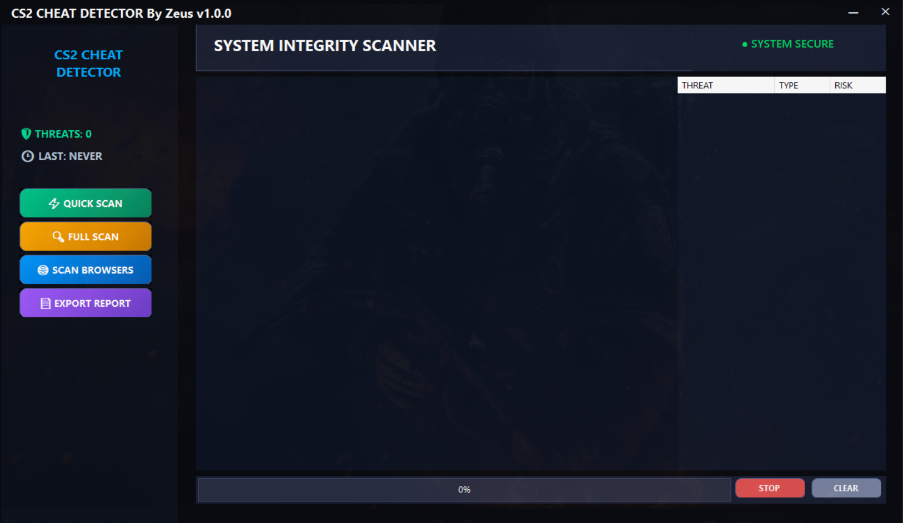

# CS2 Cheat Detector

### CS2 Cheat Detector helps server owners and players keep the game fair.

***Cheats are often installed on a player’s computer, running in the background, or hidden inside common folders. Most community servers don’t have advanced anti-cheat systems, so cheaters can play without being detected.***

## This tool solves that by:

- 🔍 Checking the player’s system for known cheat signs
- ⚡ Detecting suspicious activity before or during gameplay
- 🛡 Helping admins verify players in a safe way
- 🧠 Working without modifying files or spying on private data

## It is especially useful for:

- Community CS2 servers

- Tournament checks

- Tryouts or trusted-player verification

- Detecting public, rage and semi-private cheats

## What each scan detects?

### ⚡ Quick Scan

**Fast check of the most common cheat locations**

Best for:

`Fast checks
Before joining a server`

### 🧠 Full Scan

**Deep scan of the entire system**

Best for:

`High-risk players
Tournament verification
When cheating is suspected`

### 🌐 Browser Scan

**Checks browser data for cheat-related traces**

Checks:

`Download history for known cheat files
Cheat websites and loaders (by pattern, not content)
Leftover download traces even if the file was deleted`

**📄 Export Report**

**Why exporting a report is useful**

Checks:

`The Export Report feature allows you to save the scan results in a clear and readable file.
This makes it easy to review results later, share them with admins, or store evidence for player verification.`

Community Servers: keep casual servers free from closet cheaters.
Competitive Matches: ensure fair play in tournaments.

With CS2 Cheat Detector, you can control your server’s integrity and stay ahead of evolving.

## Official Discord (Updates/Downloads)

